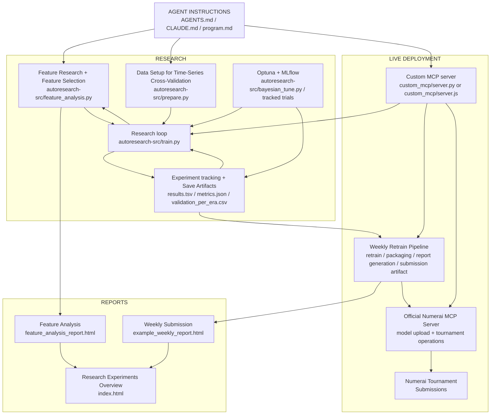

# Numerai MCP + Autoresearch Project

GitHub Pages: <a href="https://rnop.github.io/numerai-mcp-autoresearch/" target="_blank">View Research Overview</a>

## Overview

This is an agentic autoresearch and deployment harness for Numerai classic tournament that combines:

- Orchestrating agents with instructions in `program.md`, `AGENTS.md` (Codex), and `CLAUDE.md` (Claude Code)
- Karpathy-inspired autoresearch structure in `autoresearch-src/prepare.py`, `autoresearch-src/train.py`, and `program.md` for feature analysis, experimentation loop, and logging results
- Feature analysis with dynamic per-era feature selection
- Bayesian optimization with Optuna and MLflow-backed experiment tracking
- Walk-forward training and time-series cross-validation
- Custom MCP server in both Python and TypeScript + Numerai's official MCP server with agent skills for weekly retraining, data drift, predictions, and submissions
- Structured weekly submissions with generated HTML summary reports

## Main Files

- `AGENTS.md` and `CLAUDE.md`:
  Collaboration instructions used to steer agent behavior during research
- `autoresearch-src/train.py`:
  Main research loop for validation runs. Supports walk-forward evaluation and
  dynamic feature selection
- `autoresearch-src/prepare.py`:
  Data loading and preprocessing, Numerai metrics, and evaluation setup
- `program.md`:
  Agent-readable research manual that defines the optimization loop and constraints
- `autoresearch-src/feature_analysis.py`:
  Exploratory feature analysis workflow for dynamic feature selection
- `autoresearch-src/bayesian_tune.py`: 
  Setup Bayesian optimization with Optuna + MLflow experiment tracking
- `custom_mcp/make_submission.py`:
  Operational live-model packaging and weekly retrain entrypoint
- `custom_mcp/server.py`:
  Operational MCP layer for weekly retraining, feature-diffing, summaries, and report generation
- `custom_mcp/server.ts` / `custom_mcp/server.js`:
  TypeScript MCP layer that mirrors the weekly operational tools while reusing Python helpers for model-specific work
- `custom_mcp/site_builder.py`:
  HTML report and dashboard generator for weekly and research outputs
- `docs/index.html`:
  A browser-friendly HTML page organizing experiment summaries, weekly reports, and feature analysis

## System architecture



## Live Deployed Strategy

The live deployed strategy showcased here centers on:

- Target: `target_ender_60`
- Model: XGBoost trained on GPU
- Evaluation CORR target: `target_ender_20`
- Walk-forward regime: 142-era lookback with a 4-era purge
- Feature strategy: dynamic top-K ranking over a 699-feature candidate pool
- Benchmark neutralization: 10% vs `v52_lgbm_ender20`
- Validation Sharpe: `val_sharpe = 1.582`
- Validation evals: `val_corr_mean = 0.01545`, `val_mmc_mean = 0.00270`
- Baseline evals: `val_corr_mean = 0.00932`, `val_mmc_mean = 0.00144`

Follow the models here:
- [ANGOSTURA](https://numer.ai/angostura)
- [PIXELATED](https://numer.ai/pixelated)
- [TAILSPIN](https://numer.ai/tailspin)


## Weekly MCP orchestration prompt

To make the agent workflow explicit, the repo includes the weekly operations prompt in `WEEKLY_SUBMISSION_PROMPT.md`.

The orchestration prompt connects the agent to the custom MCP + Numerai's official MCP with agent skills for weekly retraining, generating predictions, and submissions:

```md
Follow the instructions in `WEEKLY_SUBMISSION_PROMPT.md` for weekly retraining, validation, data drift analysis, feature comparison, report generation, and model uploads.
```

## TypeScript MCP server

The repo now includes a sibling TypeScript implementation of the weekly MCP server:

- Source: `custom_mcp/server.ts`
- Runnable JS artifact: `custom_mcp/server.js`
- Python bridge for parquet/report helpers: `custom_mcp/ts_bridge.py`

If you want to point an MCP client at the TypeScript version instead of the Python version, use:

```json
{
  "mcpServers": {
    "numerai-weekly-ts": {
      "type": "stdio",
      "command": "node",
      "args": ["custom_mcp/server.js"]
    }
  }
}
```

The TypeScript server keeps the Python training and report internals intact. It handles MCP transport, tool routing, process orchestration, metadata diffs, and report assembly in TypeScript, then calls Python only where the project already depends on Python-specific runtime behavior.

## Weekly Reports

The agent uses `custom_mcp/site_builder.py` to generate an HTML layer from evaluated artifacts that can be opened in any browser:

- `docs/index.html` — Research Experiments Overview: a dashboard-style landing page with experiment leaderboard, best-metric cards, and links to all reports.
- `docs/example_weekly_report.html` — weekly operations report covering the currently deployed model, feature changes, and training configuration.
- `docs/feature_analysis_report.html` — interactive feature and feature-set evaluation metrics across validation eras.
