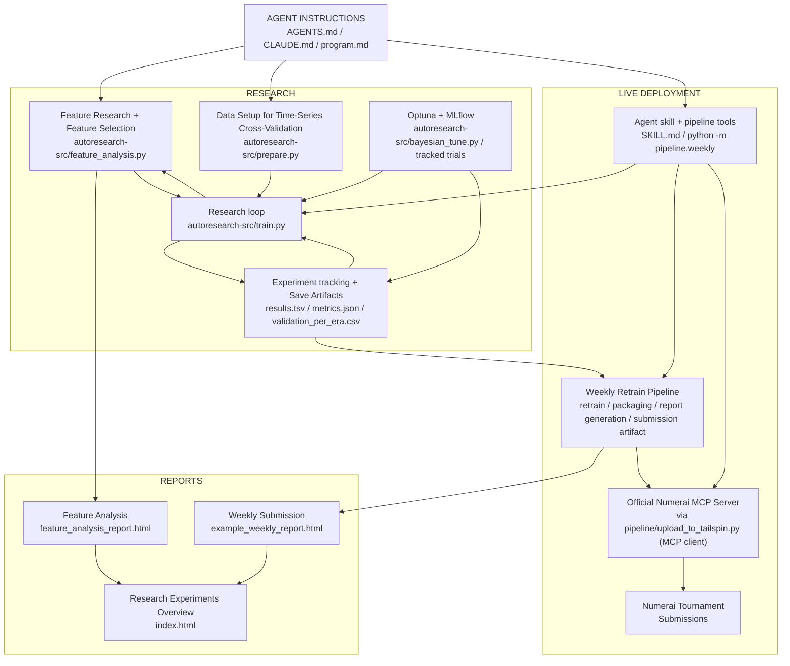

# Numerai MCP + Autoresearch Project

[](https://github.com/rnop/numerai-mcp-autoresearch/actions/workflows/ci-cd.yml)

GitHub Pages: <a href="https://rnop.github.io/numerai-mcp-autoresearch/" target="_blank">View Live Deployment and Autoresearch HTML Report</a>

## Overview

This is an agentic autoresearch and deployment harness for Numerai classic tournament that combines:

- Orchestrating agents with instructions in `program.md` (agent-neutral - Claude, Codex, etc.)
- Autoresearch inspired by Karpathy in `autoresearch-src/prepare.py`, `autoresearch-src/train.py`, and `program.md` for feature analysis, experimentation loop, and logging results. 
- Feature analysis with dynamic per-era feature selection
- Bayesian optimization with Optuna and MLflow-backed experiment tracking
- Walk-forward training and time-series cross-validation
- Agent tool use for the weekly loop: a JSON CLI of pipeline tools driven by agent skills, plus an MCP client for Numerai's official MCP server to handle submissions
- Structured weekly submissions with generated HTML summary reports

## Weekly orchestration prompt

Agent skills, tools, and instructions are written in the playbook located at `playbooks/weekly-submission.md`. 

The playbook gives the agent two kinds of tools, split at the network boundary:

- **Local tools** (`python -m pipeline.weekly retrain | status | qa | summary | diff | report`) for retraining, QA, drift analysis, and reporting. Each command prints one JSON object with a `next` field telling the agent what to do next, and exit code `2` means a gate (QA fail, no new data) said stop.
- **Numerai's official MCP server** for uploads, driven by `pipeline/upload_to_tailspin.py` as an MCP client.

The local tools deliberately aren't an MCP server. They run on the same machine as the agent and have one client, so a CLI does the same job with less machinery. MCP is used where it earns its place: at the boundary with an external service that owns its own tools and auth.

Agent-neutral (Claude, Codex, etc.) weekly prompt: 

```md
Follow the instructions in `playbooks/weekly-submission.md` for weekly retraining, validation, data drift analysis, feature comparison, report generation, model uploads, and committing and pushing the results to GitHub (which triggers the CI/CD pipeline).
```

## Main Files

**Agent instructions:**
- `AGENTS.md` and `CLAUDE.md`:
  Collaboration instructions used to steer agent behavior during research

**Autoresearch for data analysis, experimentation, and machine learning:**
- `autoresearch-src/train.py`:
  Main research loop for validation runs. Supports walk-forward evaluation and
  dynamic feature selection
- `autoresearch-src/prepare.py`:
  Data loading and preprocessing, Numerai metrics, and evaluation setup
- `program.md`:
  Agent-readable research manual that defines the optimization loop and constraints
- `autoresearch-src/feature_analysis.py`:
  Exploratory feature analysis workflow for dynamic feature selection
- `autoresearch-src/bayesian_tune.py`: 
  Setup Bayesian optimization with Optuna + MLflow experiment tracking

**Weekly orchestration, tools, and reporting:**
- `playbooks/weekly-submission.md` and `.claude/skills/weekly-submission/SKILL.md`:
  The weekly procedure and its decision rules (when to stop, when to flag, when to upload)
- `pipeline/weekly.py`:
  The agent's tool surface: retrain, status, live-prediction QA gate, feature drift, and report generation, exposed as a JSON CLI
- `pipeline/make_submission.py`:
  Operational live-model packaging and weekly retrain entrypoint
- `pipeline/upload_to_tailspin.py`:
  MCP client that drives Numerai's official MCP server through the full upload handoff
- `pipeline/site_builder.py`:
  HTML report and dashboard generator for weekly and research outputs
- `docs/index.html`:
  A browser-friendly HTML home page organizing experiment summaries, weekly reports, and feature analysis
- `docs/example_weekly_report.html`: Weekly operations report covering the currently deployed model, feature changes, and training configuration.
- `docs/feature_analysis_report.html`: Interactive feature and feature-set evaluation metrics across validation eras.
- `.github/workflows/ci-cd.yml`:
  GitHub Actions pipeline: lint and unit tests on every push and PR (`tests/`), then deploy `docs/` to GitHub Pages from master once they pass


## System architecture


```mermaid
flowchart TD
    A["AGENT INSTRUCTIONS<br/>AGENTS.md / CLAUDE.md / program.md"]

    subgraph Research["RESEARCH"]
        direction TB
        C["Feature Research + Feature Selection<br/>autoresearch-src/feature_analysis.py"]
        D["Data Setup for Time-Series Cross-Validation<br/>autoresearch-src/prepare.py"]
        B["Research loop<br/>autoresearch-src/train.py"]
        H["Optuna + MLflow<br/>autoresearch-src/bayesian_tune.py / tracked trials"]
        F["Experiment tracking + Save Artifacts<br/>results.tsv / metrics.json / validation_per_era.csv"]
        D --> B
        H --> B
        H --> F
        B --> F
        F --> B
        B --> C
    end

    subgraph Reports["REPORTS"]
        direction TB
        N["Feature Analysis<br/>feature_analysis_report.html"]
        P["Weekly Submission<br/>example_weekly_report.html"]
        Q["Research Experiments Overview<br/>index.html"]
        C --> N
        N --> Q
        P --> Q
    end

    subgraph Live["LIVE DEPLOYMENT"]
        direction TB
        L["Agent skill + pipeline tools<br/>SKILL.md / python -m pipeline.weekly"]
        J["Weekly Retrain Pipeline<br/>retrain / packaging / report generation / submission artifact"]
        R["Official Numerai MCP Server<br/>via pipeline/upload_to_tailspin.py (MCP client)"]
        S["Numerai Tournament<br/>Submissions"]
        L --> B
        L --> J
        J --> P
        R --> S
    end

    A --> C
    A --> D
    A --> L
    C --> B
    F --> J
    L --> R
    J --> R
```

## Live Deployed Strategy

The live deployed strategy showcased here centers on:

- Target: `target_ender_60`
- Model: XGBoost trained on GPU
- Evaluation CORR target: `target_ender_20`
- Walk-forward regime: 142-era lookback with a 4-era purge
- Feature strategy: dynamic top-K ranking over a 699-feature candidate pool
- Benchmark neutralization: 10% vs `v52_lgbm_ender20`
- Validation Sharpe: `val_sharpe = 1.582`
- Validation evals: `val_corr_mean = 0.01545`, `val_mmc_mean = 0.00270`
- Baseline evals: `val_corr_mean = 0.00932`, `val_mmc_mean = 0.00144`

### Follow the models here:
- [ANGOSTURA](https://numer.ai/angostura)
- [PIXELATED](https://numer.ai/pixelated)
- [TAILSPIN](https://numer.ai/tailspin)